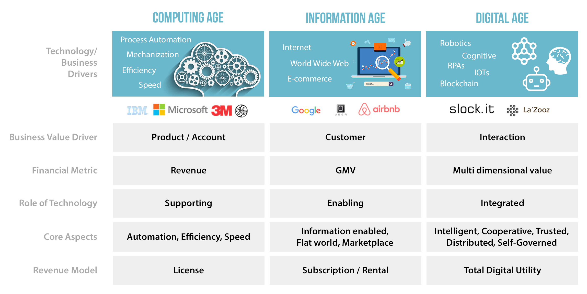

# KIP Whitepaper

**TABLE OF CONTENTS**
- [KIP Whitepaper](#kip-whitepaper)
    - [The digital ages](#the-digital-ages)
        - [Background](#background)
        - [Introduction](#introduction)
    - [Krama - The new digital order](#krama---the-new-digital-order)
        - [Existing platforms & problems](#existing-platforms-problems)
        - [System Overview](#system-overview)
    - [Beyond blockchain](#beyond-blockchain)
        - [An architectural renaissance](#an-architectural-renaissance)
        - [Distributed Marketplace](#distributed-marketplace)
        - [Token economy & DEX](#token-economy-dex)
    - [Enterprise adoption](#enterprise-adoption)
        - [Solution models](#solution-models)
        - [Financial models](#financial-models)
        - [Governance models](#governance-models)
    - [Conclusion](#conclusion)
    - [References](#references)
    - [Further Reading](#further-reading)

## The digital ages

### Background

Evolution of business and its underlying processes always encourage technological advancement in computation & storage. This time, it seems to stress on “Trust” over the IT setup for existing business models and new ones alike.

A few attributes that fits a distributed app to a “real-world scenario” :  
1\) Upgradability & Agility  
2\) Robust Security  
3\) Scalability  
4\) Responsiveness  
5\) Accountability  

Looking at how the world has evolved, we’ve gone through different eras of the technological advancement in computers and storage. 

- **Age of Information**  

  It all started with the computing era in late 50’s and the early 60’s when computers were being used to process mathematical and scientific calculations to improve speed and accuracy. Data was moved from papers to a disks and tapes. Traditional business processes were transformed by the help of computers resulting in increased efficiency. Computers increased the productivity of companies by several folds. A lot of companies started in this era that wrote software to help businesses and then licensed these software to end users. The unit of value in this computing era was the ‘Product’ and Technology played a very supportive role although early in its existence. 

- **Age of Augmentation**  

  The introduction of TCP/IP to the world proved to be the fusion of the information era with augmentation at individual and institutional levels. TCP/IP allowed the flattening of the world. Anybody with a computer could be connected to other computers around the world and it created an immense opportunity to host services to interact and exchange information with each other. New value driven models moved from product-centric to customer-centric. The success of most companies was directly proportional to the number of customers a company had. Search engine companies occupied mainstream spotlight as they had the best number of customers using their services. Lots of other start-ups like Amazon, Facebook, Airbnb and Uber were born that leveraged the power of internet to discover network effects. But such intermediaries and aggregators influenced everything in the market dynamics as everything in this era was mostly centralised. 

- **Age of Intelligence**  

  From the information era where everything is centralised, we are now moving on to an age where everything is being decentralised. In contrast to the augmented age, "Interaction" is the key to driving new values in the hyper connected digital world. New Business came into existence that relied solely on the interaction of the community. For example, people started using Twitter to communicate and spread ideas and the interaction between people on Twitter proved to be the key value driver for Twitter’s success. This digital age will absorb technical advancements such as Blockchain, Cognitive, Robotics, IoT, and RPA to evolve new business values and change our lifestyle as we see it today. 

### Introduction

KIP is a business-ready Blockchain network with Multi-dimensional value persistence of digital interactions, modulated trust, and reliable cognition.

We are in a digitally connected world where constant interactions are creating networks that have a personality resembling real world human networks. Krama is essentially a cooperative digital mesh that supports creating the digital order. 

Krama seamlessly brings together Intelligence, Connectedness and Trust (the new ICT!) to create a fundamental digital fabric on which new digital services can be directly built by evolving a new principle of Total Digital Utility (TDU).

## Krama - The new digital order

### Existing platforms & problems

Bitcoin and the underlying blockchain are both technological masterstrokes. Blockchain gives back the power in the hands of individuals by removing the need of intermediaries to exchange value directly, hence truly enabling decentralized economies and transform tedious processes. But in real world scenarios, Blockchain must be paired up with other technologies to truly disrupt the landscape. Krama takes care of it by adding context to the blockchain by introducing Goal State Provenance and Cognition into the equation. 

### System Overview

## Beyond blockchain

### An architectural renaissance

### Distributed Marketplace

### Token economy & DEX

KIP Tokens are an universal interface to all app tokens on the KIP platform and affiliated marketplaces. Developers specify the app token characteristics using Krama Tokenization Services. This is reflected in the token interface smart contract corresponding to the diApp, takes the service usage into account and charge the user for the same.

KIP stands out from the rest in Tokenization aspects by allowing both buffer & exchange mechanisms, thereby achieving a universal interface that balances the supply demand of app tokens in the digital ecosystem. All app tokens shall be ICO’ed by the entity offering the DIapp solution and integrated with an inline index to address volatility and entry.

KIP also possesses a unique self-balancing utilitarian formula to calculate platform fee and transaction fee for nodes responsible for consensus, and incentivizes the validators’ interests by awarding slice of TDU Scores in the dimensions relevant to trust and economic activities.

## Enterprise adoption

### Solution models

### Financial models

### Governance models
- **Miner nodes admission**  
  Entities willing to participate as validating nodes in the KIP network need to pass an entry test to ensure a predicted performance before reflecting the KIP's network revision.

## Conclusion
Krama Intelligence Protocol caters to the needs of the modern distributed intelligent applications(diApps) by favouring support in scalability, maximized throughput, .

## References

\[1\] Satoshi Nakamoto. “Bitcoin: A Peer-to-Peer Electronic Cash System.” 2008; https://bitcoin.org/bitcoin.pdf

\[2\] Vitalik Buterin. “A next generation smart contract & decentralized application platform” 2013; https://github.com/ethereum/wiki/wiki/White-Paper  

\[3\] Daniel Larimer et al. . "EOS Technical Whitepaper" 2017;
https://github.com/EOSIO/Documentation/blob/master/TechnicalWhitePaper.md

\[4\] Ocean Protocol Foundation. “Ocean Protocol: A Decentralized Substrate for AI Data & Services” 2018; https://oceanprotocol.com/tech-whitepaper.pdf

\[5\] Protocol Labs. “Filecoin: A Decentralized Storage Network” 2017; https://filecoin.io/filecoin.pdf

\[6\] Vlad Zamfir. “Introducing Casper “the Friendly Ghost”” 2015; https://blog.ethereum.org/2015/08/01/introducing-casper-friendly-ghost/

\[7\] Castro, Miguel, and Barbara Liskov. “Practical Byzantine Fault Tolerance.” SDI. Vol. 99. 1999; http://pmg.csail.mit.edu/papers/osdi99.pdf

\[8\] Ganesh Prasad Kumble. “TARA: Ternary Augmented Raft Architecture” 2017; https://github.com/TARAFramework/docs/blob/master/TARA.pdf

## Further Reading

<!-- 1.  -->